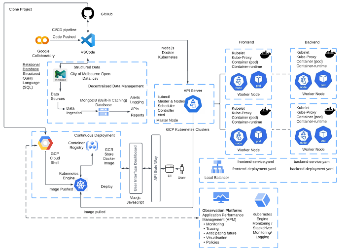
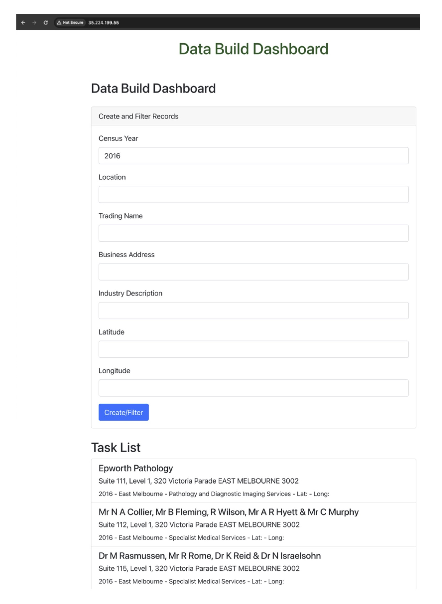

### DataBuild

#### A web application that displays data from MongoDB database in a dashboard!
- A dashboard which displays historical data from the City of Melbourne Open Data using Google Cloud Platform (GCP). 
- The Application in GCP (Google Cloud Platform) uses Docker and Kubernetes containerisation (Clusters, MongoDb, and Vue.js) to analyses Melbourne’s environmental data to support public safety.

#### Cloud Native Application (CNA) Main Aspects
1. MongoDB database
2. CRUD operations
3. Node.js backend
4. React Frontend

#### Technology Stack
- Frontend (ui)
1. React: JavaScript library for user interface
2. React Hook Form: A library for handling form validation
3. Bootstrap: A CSS framework for design (responsive)

#### DataBuild Technology Stack
- Backend (api)
1. Node.js: Javascript runtime build using Chrome’s engine Version 16.0.0
2. Express: A web application framework to support Node.js
3. Mongoose: An ODM (Object Data Modelling library for MongoDB and Node.js)
4. Config file: Set environment Variables/ .json for dev or test environments

#### DataBuild Technology Stack
- Database (db)
1. db/index.js as the script that connects MongoDB db - Imports mongoose library 
2. models/dashboards/dashboadData.js sets schema and exports model
3. MongoDB: A cloud hosted NoSQL database Service

#### DataBuild Tools
1. Docker: Developing, running applications in containers & MongoShell!
2. GKE: Google Kubernetes Engine, service for deploy/ scaling apps using docker
3. dotenv: module to load environment variables
4. Alert Policies and Logs: Monitor and notify cluster data changes in GKE
5. Scripts: server.js sets Express Server, ports and connects MongoDB

#### User interface (dashboard) 
- MongoDB - SQL as Google Storage with User interface (dashboard) 
- Developed with frontend scripts data visualisations quiring / filtering and backend scripts using React and axios
- Different /components (frontend) AddData to change the state and Dashboard to display the mongoDB data
- App integrates AddData and Dashboard to manage app state and interactions

#### GKE Clusters
- zone australia-southeast2  
- project sit323-24t1-te-claire-15b5962  
- num-nodes=3 
- enable-autoscaling  
- min-nodes=1  
- max-nodes=5
- machine-type=e2-medium

#### Kubernetes
- Deployment and Services
1. Deployment a resource object that adds updates to application (backend-deployment.yml)
2. Service abstraction which sets the logic of pods and the policy via DNS (backend-service.yml)

#### Monitoring / Logs / Alert Policies
- Created Alert policies
- Email notifications for GKE Container
1. High CPU Limit
2. Hight Memory Limit
3. Restarts (All containers)

